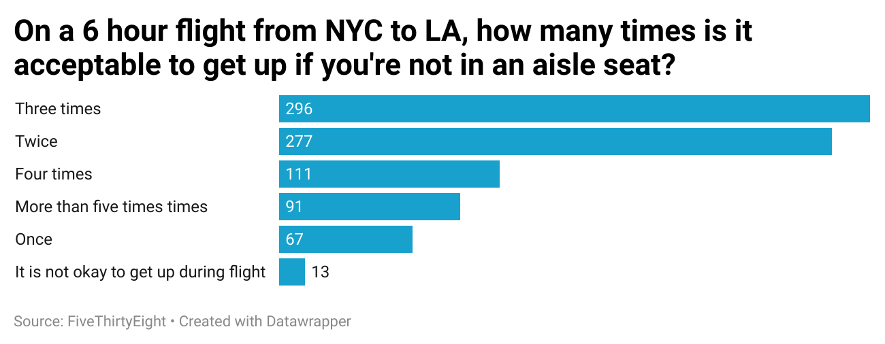

## Flying Etiquette: How Often Can You Get Up?

I chose to explore the question: **"On a 6-hour flight from NYC to LA, how many times is it acceptable to get up if you're not in an aisle seat?"**  
This topic caught my interest because it reflects a common but often unspoken social dilemma in air travel. It combines etiquette, personal comfort, and social norms — making it both relatable and revealing.

The chart below visualizes the responses from over 1,000 participants. Most people (296) believe it’s acceptable to get up **three times**, followed by **two times** (277). Very few respondents (13) said it’s not okay to get up at all. This suggests that most travelers are willing to tolerate some movement — but within reason.

_Source: [FiveThirtyEight](https://github.com/fivethirtyeight/data/tree/master/flying-etiquette-survey)_
